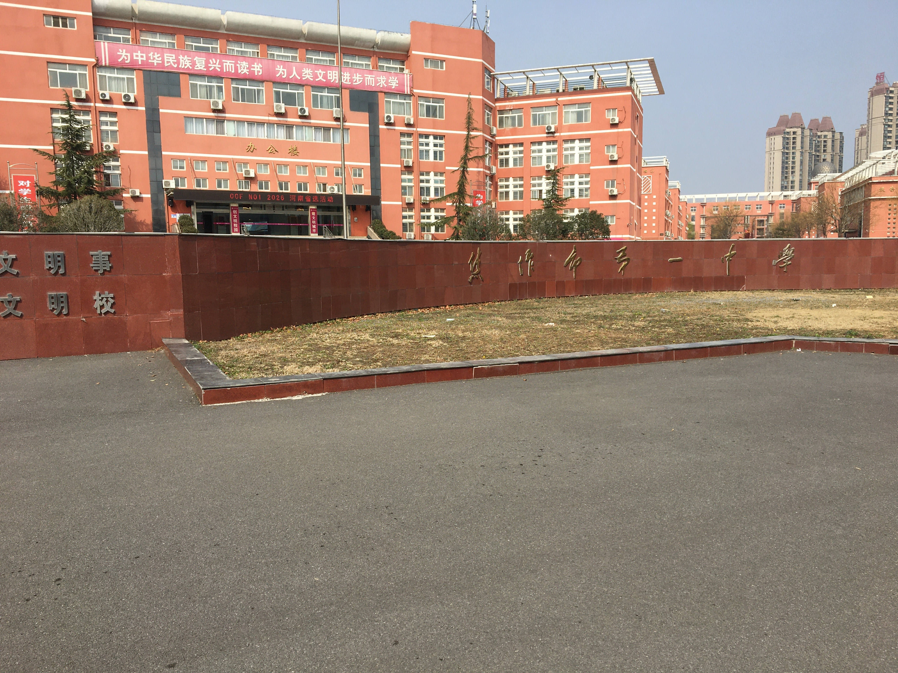

## 关于省选

- day1T1 不会
- day1T2 不会
- day1T3 不会
- day2T1 场上想到稳定 $2n-4$ 做法，询问每一段前缀和后缀，可以确定一些位置上的数字，如果不能确定该位置的具体数字，就必然能确定这个位置上的数大于等于几，把剩下的数字合法地填到相应位置上即可。
- day2T2 不会
- day2T3 不会     

我的 OI 结束了（可能还会参加 NOIP2026）。

## 其他

这段文字我在 2026.6.25 进行了修改，之前写的文字太过文艺了，也不像我。      
我大概内耗了半年，我也没有想到我会内耗这么长时间。     
我对很多事情都很感兴趣，我却又被很多事情迁就和耽误。我也希望我自己能继续坚持下去。       
希望我们都有光明的未来

> 星图铺就的，未必是归途。    
> 但有人循着它，便不算迷路。      
> —— [省选联考 2026] starmap